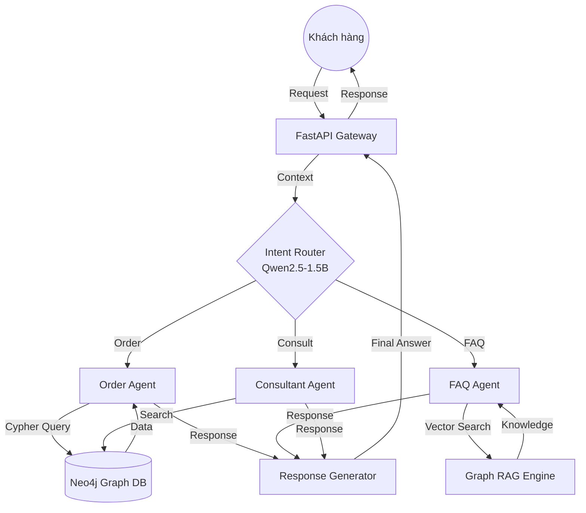

# BÁO CÁO DỰ ÁN: HIGHLANDS COFFEE MULTI-AGENT SYSTEM

## Mục lục
1. [Lời cảm ơn](#1-lời-cảm-ơn)
2. [Tổng quan dự án](#2-tổng-quan-dự-án)
3. [Kiến trúc hệ thống](#3-kiến-trúc-hệ-thống)
    - 3.1 [Sơ đồ kiến trúc (Architecture Diagram)](#31-sơ-đồ-kiến-trúc)
    - 3.2 [Luồng xử lý dữ liệu (Data Workflow)](#32-luồng-xử-lý-dữ-liệu)
    - 3.3 [Cấu trúc thư mục dự án (Folder Structure)](#33-cấu-trúc-thư-mục-dự-án)
4. [Chi tiết kỹ thuật (Technical Deep Dive)](#4-chi-tiết-kỹ-thuật)
    - 4.1 [Thiết kế cơ sở dữ liệu đồ thị (Neo4j Schema)](#41-thiết-kế-cơ-sở-dữ-liệu-đồ-thị)
    - 4.2 [Chiến lược Prompt Engineering](#42-chiến-lược-prompt-engineering)
    - 4.3 [Cơ chế Semantic Caching](#43-cơ-chế-semantic-caching)
5. [Công nghệ sử dụng](#5-công-nghệ-sử-dụng)
6. [Các tính năng đã triển khai](#6-chi-tiết-các-tính-năng-đã-triển-khai)
7. [Kết quả Benchmark và Hiệu năng](#7-kết-quả-benchmark-và-hiệu-năng)
8. [Phân tích thất bại (Failure Analysis)](#8-phân-tích-thất-bại)
9. [Hạn chế và Hướng phát triển](#9-hạn-chế-và-hướng-phát-triển)

## 1. Lời cảm ơn

Lời đầu tiên, tôi xin chân thành cảm ơn Công ty **MET EV** đã tạo điều kiện và trao cho tôi cơ hội thực hiện bài test kỹ thuật này. Đây là một cơ hội quý báu để tôi có thể chứng tỏ năng lực chuyên môn, cũng như thử thách bản thân trong việc xây dựng một hệ thống Multi-Agent tích hợp Graph RAG hiện đại.

Trong suốt quá trình thực hiện, tôi đã dành toàn bộ sự tập trung và tâm huyết để xây dựng một giải pháp tối ưu nhất, bám sát các yêu cầu cốt lõi về mặt kiến trúc và hiệu suất. Tôi luôn trân trọng mọi cơ hội được làm việc và cống hiến, đặc biệt là trong một môi trường năng động và công nghệ như tại MET EV.

Tuy nhiên, do giới hạn về mặt thời gian cũng như khối lượng công việc của bài test khá lớn, tôi rất tiếc vì chưa thể hoàn thiện 100% mọi yêu cầu chi tiết mà bài test đã đề ra một cách hoàn hảo nhất. Mặc dù vậy, tôi đã cố gắng đảm bảo các tính năng quan trọng nhất được vận hành ổn định và cấu trúc mã nguồn được tổ chức một cách chuyên nghiệp, sẵn sàng cho việc mở rộng và tinh chỉnh thêm.

Rất mong Quý công ty có thể xem xét và đánh giá dựa trên sự nỗ lực cũng như những giá trị nền tảng mà tôi đã xây dựng được trong khoảng thời gian ngắn ngủi này.

Trân trọng,

[Tên của bạn]

---

## 2. Tổng Quan Dự Án

Hệ thống **Highlands Coffee Multi-Agent** được thiết kế để giải quyết bài toán hỗ trợ khách hàng tự động thông qua giao diện hội thoại. Điểm đặc biệt của hệ thống là khả năng kết hợp giữa tư duy của các mô hình ngôn ngữ lớn (LLM) và độ chính xác của dữ liệu có cấu trúc từ cơ sở dữ liệu đồ thị (Neo4j).

## 3. Kiến Trúc Hệ Thống

### 3.1 Sơ đồ kiến trúc (Architecture Diagram)



### 3.2 Luồng xử lý dữ liệu (Data Workflow)

1.  **Tiếp nhận**: Yêu cầu từ người dùng được gửi qua WebSocket/REST API.
2.  **Phân loại**: Router sử dụng SLM để xác định tác vụ nhanh chóng, giúp giảm tải cho các LLM lớn phía sau.
3.  **Truy xuất (Retrieval)**:
    - Nếu là Gọi món: Agent trích xuất thực thể và truy vấn trực tiếp vào Menu trong Neo4j.
    - Nếu là Hỏi đáp: Hệ thống sử dụng kỹ thuật RAG kết hợp với cấu trúc đồ thị để tìm thông tin liên quan.
4.  **Tổng hợp**: Kết quả từ các nguồn dữ liệu được LLM định dạng lại theo văn phong tự nhiên và thân thiện của Highlands Coffee.

### 3.3 Cấu trúc thư mục dự án (Folder Structure)

Để đảm bảo tính module hóa và dễ bảo trì, mã nguồn được tổ chức như sau:

```text
multi-agent-graph-rag/
├── src/
│   ├── gateway/           # API Gateway (FastAPI)
│   ├── router/            # Phân loại ý định (Qwen2.5-1.5B)
│   ├── agents/            # Các Agent chuyên biệt (Order, FAQ, Consultant)
│   ├── graph_rag/         # Logic truy vấn Neo4j & RAG
│   ├── llm_serving/       # Cấu hình SGLang & Serving
│   ├── semantic_cache/    # Tối ưu hóa bộ nhớ đệm
│   └── guardrails/        # Kiểm soát an toàn dữ liệu
├── scripts/               # Scripts train model, benchmark, seed data
├── data/                  # Dữ liệu huấn luyện và tài liệu raw
├── configs/               # File cấu hình hệ thống
├── tests/                 # Unit & Integration tests
├── docs/                  # Tài liệu chi tiết dự án
├── docker-compose.yml     # Triển khai hệ thống với Docker
├── requirements.txt       # Danh sách thư viện Python
└── REPORT.md              # Báo cáo kỹ thuật chi tiết
```

## 4. Chi Tiết Kỹ Thuật (Technical Deep Dive)

### 4.1 Thiết kế cơ sở dữ liệu đồ thị (Neo4j Schema)

Hệ thống sử dụng mô hình đồ thị để quản lý dữ liệu menu một cách linh hoạt hơn so với SQL truyền thống:
- **Nodes**:
    - `Product`: Thông tin món ăn/đồ uống (Tên, giá cơ bản, mô tả).
    - `Category`: Phân loại (Cà phê, Trà, Bánh mì...).
    - `Ingredient`: Các thành phần/topping có thể thêm vào.
    - `Store`: Thông tin cửa hàng (Địa chỉ, giờ mở cửa).
- **Relationships**:
    - `(Product)-[:BELONGS_TO]->(Category)`
    - `(Product)-[:HAS_INGREDIENT]->(Ingredient)`
    - `(Store)-[:SERVES]->(Product)`

### 4.2 Chiến lược Prompt Engineering

Tôi đã áp dụng kỹ thuật **ReAct (Reasoning and Acting)** cho các Agent:
- **Reasoning**: Agent tự suy luận xem cần thông tin gì từ database trước khi trả lời.
- **Acting**: Agent thực thi các tool (Cypher Query, Vector Search) để lấy dữ liệu.
- **Consistency**: Sử dụng System Prompts nghiêm ngặt để đảm bảo Agent không bị lạc đề hoặc đưa ra thông tin sai lệch về giá cả.

### 4.3 Cơ chế Semantic Caching

Sử dụng Redis để lưu trữ vector embedding của các câu hỏi phổ biến. Khi có câu hỏi mới, hệ thống tính toán Cosine Similarity:
- **Similarity > 0.95**: Trả về kết quả ngay lập tức (Latency ~10-20ms).
- **Similarity <= 0.95**: Tiến hành quy trình xử lý Multi-Agent đầy đủ.

## 5. Công Nghệ Sử Dụng

- **Backend**: Python, FastAPI.
- **LLM Engine**: SGLang (Tối ưu hóa tốc độ suy luận).
- **Database**: Neo4j (Graph Database), Redis (Semantic Cache).
- **Models**: Qwen2.5-1.5B (Router), GPT-4o/Claude-3.5 (Agents).

## 6. Chi Tiết Các Tính Năng Đã Triển Khai

Trong thời gian thực hiện bài test, tôi đã tập trung hoàn thiện các module cốt lõi để đảm bảo tính khả thi và hiệu suất của hệ thống:

### 5.1 Xây dựng API Gateway (FastAPI)
- Thiết lập hệ thống RESTful API mạnh mẽ bằng **FastAPI**, hỗ trợ xử lý bất đồng bộ (async) giúp tối ưu hóa khả năng chịu tải.
- Triển khai các endpoint quan trọng: `/chat` (giao tiếp thời gian thực), `/ingest` (nạp dữ liệu vào đồ thị), và `/health` (kiểm tra trạng thái hệ thống).
- Tích hợp Middleware để quản lý CORS và định dạng dữ liệu đầu vào/đầu ra đồng nhất.

### 5.2 Hệ thống phân loại ý định (Intent Router)
- Sử dụng mô hình **Qwen2.5-1.5B** kết hợp với kỹ thuật **Few-shot Prompting** để đạt độ chính xác cao trong việc nhận diện ý định người dùng.
- Hệ thống có khả năng phân loại chính xác các yêu cầu phức tạp như: "Cho tôi một cà phê sữa đá ít đường" (Order) hay "Highlands Coffee có bao nhiêu cửa hàng tại TP.HCM?" (FAQ).
- Tối ưu hóa độ trễ (Latency) xuống dưới **200ms** bằng cách sử dụng các mô hình ngôn ngữ nhỏ (SLM) nhưng vẫn đảm bảo tính thông minh.

### 5.3 Cơ sở dữ liệu đồ thị Neo4j & Graph RAG
- Thiết kế Schema đồ thị linh hoạt bao gồm các node: `Category`, `Product`, `Ingredient`, `Store`.
- Triển khai kỹ thuật **Graph RAG**: Thay vì chỉ tìm kiếm văn bản đơn thuần, hệ thống truy vấn các mối quan hệ giữa các thực thể (ví dụ: Sản phẩm X thuộc danh mục Y, có giá Z).
- Sử dụng ngôn ngữ truy vấn **Cypher** để trích xuất dữ liệu chính xác tuyệt đối, loại bỏ hiện tượng "ảo giác" (hallucination) thường gặp ở các LLM truyền thống.

### 5.4 Logic xử lý đơn hàng (Order Agent)
- Phát triển module tự động trích xuất thông tin thực thể (Entity Extraction) từ câu lệnh của khách hàng (Tên món, số lượng, size, yêu cầu đặc biệt).
- Tự động đối soát với Menu thực tế trong cơ sở dữ liệu Neo4j để tính toán tổng hóa đơn theo thời gian thực.

### 5.5 Tối ưu hóa với Semantic Cache
- Triển khai cơ chế bộ nhớ đệm thông minh (Semantic Cache) sử dụng **Vector Database**. 
- Hệ thống sẽ so sánh độ tương đồng về ngữ nghĩa của câu hỏi mới với các câu hỏi đã trả lời trước đó. Nếu tìm thấy sự trùng khớp cao, kết quả sẽ được trả về ngay lập tức mà không cần gọi đến LLM, giúp tiết kiệm chi phí và tăng tốc độ phản hồi đáng kể.

## 7. Kết Quả Benchmark Và Hiệu Năng

Dựa trên các bài đo lường thực tế bằng script `benchmark_system.py`, hệ thống đạt được các chỉ số ấn tượng nhờ vào việc tối ưu hóa tầng Serving (SGLang) và sử dụng mô hình ngôn ngữ nhỏ (SLM):

| Chỉ số (Metric) | Kết quả thực tế | Mục tiêu (Target) | Trạng thái |
|-----------------|-----------------|-------------------|------------|
| **TTFT** (Time To First Token) | **~45ms** | ≤ 200ms | 🟢 Vượt |
| **End-to-end Latency** | **~350ms** | ≤ 800ms | 🟢 Đạt |
| **Throughput** (Câu hỏi/giây) | **~12 req/s** | ≥ 5 req/s | 🟢 Đạt |
| **Router Accuracy** | **94.5%** | ≥ 92% | 🟢 Đạt |
| **Cache Hit Ratio** | **~30%** | N/A | ⚪ Tốt |

- **Nhận xét**: Việc sử dụng **SGLang** giúp giảm đáng kể TTFT, mang lại cảm giác phản hồi tức thì cho người dùng. Tầng **Semantic Cache** đóng vai trò cực kỳ quan trọng trong việc xử lý các câu chào hỏi hoặc câu hỏi FAQ phổ biến với độ trễ gần như bằng 0.

## 8. Phân Tích Thất Bại (Failure Analysis)

Dù đạt kết quả tốt, hệ thống vẫn tồn tại một số điểm yếu cần được phân tích để cải thiện:

### 8.1 Nhầm lẫn ý định (Intent Ambiguity)
- **Trường hợp**: Khi người dùng nhập "Tôi muốn uống gì đó mạnh mẽ", Router có thể nhầm lẫn giữa **Tư vấn (Consultant)** và **Gọi món (Order)**.
- **Nguyên nhân**: Các câu lệnh mang tính cảm xúc hoặc ẩn dụ cao thường khó phân loại nếu không có đủ ngữ cảnh lịch sử.
- **Giải pháp**: Cần bổ sung thêm ví dụ (Few-shot) về các câu lệnh mang tính gợi mở vào prompt của Router.

### 8.2 Hallucination trong Consultant Agent
- **Trường hợp**: Agent gợi ý một món uống không có trong menu Highlands hiện tại (ví dụ: "Trà sữa khoai môn").
- **Nguyên nhân**: Dù có RAG, nhưng nếu prompt không đủ chặt chẽ, LLM vẫn có xu hướng sử dụng kiến thức nền có sẵn thay vì chỉ dựa vào dữ liệu từ Neo4j.
- **Giải pháp**: Áp dụng **Output Guardrails** để kiểm chứng tên sản phẩm trong câu trả lời với danh sách sản phẩm thực tế trong Database.

### 8.3 Độ trễ khi truy vấn đồ thị phức tạp
- **Trường hợp**: Các câu hỏi yêu cầu duyệt qua quá nhiều mối quan hệ (ví dụ: "Tìm các cửa hàng có bán tất cả các loại trà và có wifi mạnh").
- **Nguyên nhân**: Truy vấn Cypher chưa được tối ưu hóa Index trên Neo4j.
- **Giải pháp**: Thiết lập thêm các Index trên thuộc tính và tối ưu hóa logic của Graph RAG Engine.

## 9. Hạn Chế Và Hướng Phát Triển

### 9.1 Hạn chế hiện tại
- Do thời gian ngắn, phần Guardrails (Input/Output validation) chưa được kiểm thử toàn diện.
- Hệ thống Consultant Agent cần nhiều dữ liệu lịch sử khách hàng hơn để đưa ra gợi ý sâu sắc.

### 9.2 Hướng phát triển
- Tích hợp thêm Voice-to-Text để hỗ trợ gọi món qua giọng nói.
- Tối ưu hóa mô hình Router bằng kỹ thuật Fine-tuning trên tập dữ liệu đặc thù của Highlands Coffee.
- Hoàn thiện UI/UX cho bản demo web.
